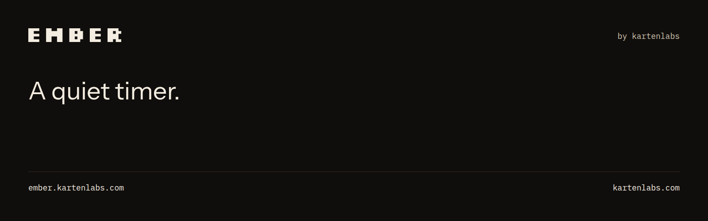
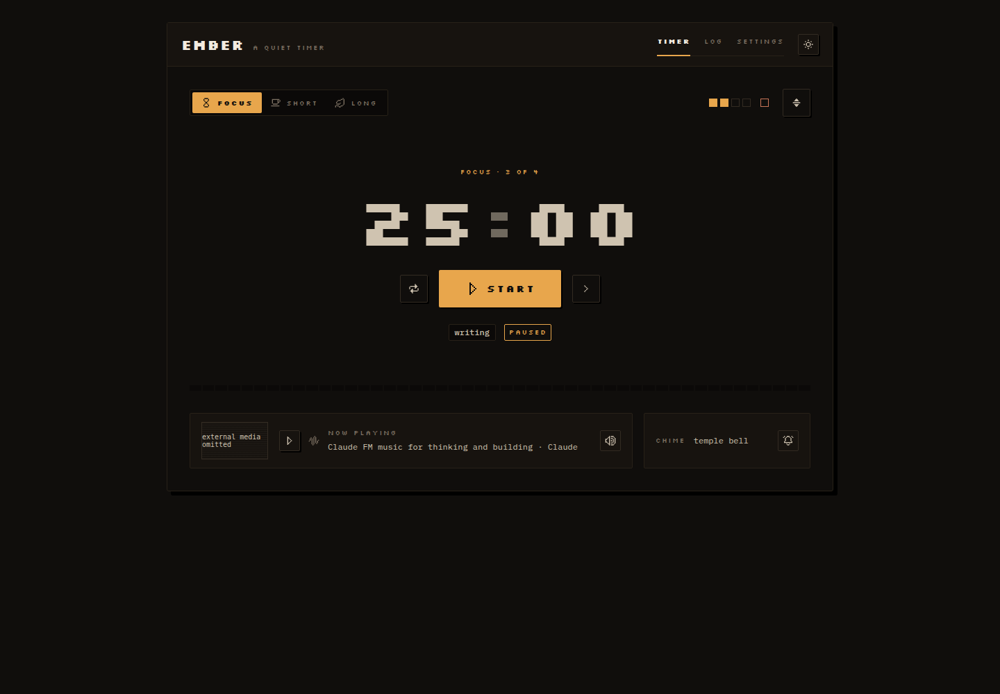
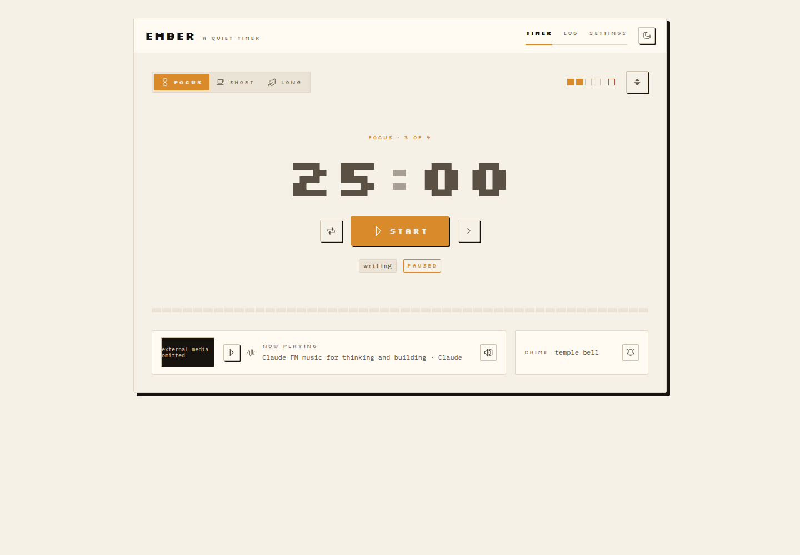

<p align="center">
  
</p>

<p align="center">
  A quiet pomodoro timer with gentle chimes, an optional ambient station,<br>
  and a session log that never leaves your browser.
</p>

<p align="center">
  <a href="https://ember.kartenlabs.com"></a>
  <a href="./LICENSE"></a>
  <a href="https://github.com/kartenlabs/ember/actions/workflows/ci.yml"></a>
  <a href="./CONTRIBUTING.md"></a>
</p>

---

Set a focus length, a short break and a long break. The countdown runs; at zero
the chime you chose plays and the session is logged. Underneath sits an optional
ambient radio strip, which stays silent and unloaded until you press play.

Pixel-first and calm: bitmap type, square corners, hard one-pixel shadows, a
warm near-black board, and three low-chroma accents that each stand for one
timer mode.

**No account, no server, no database, no analytics, no cookies.** Settings and
the session log live in `localStorage` and never leave your device. See the
[privacy page](https://ember.kartenlabs.com/privacy) for exactly what is stored.

<p align="center">
  
  &nbsp;
  
</p>

## What it does

- **Three modes** — focus, short break, long break, with adjustable lengths and
  a configurable number of sets per cycle.
- **Five chimes**, synthesised at play time from oscillators. No audio file is
  bundled or downloaded, and each can be auditioned before you pick it.
- **A session log** — today's sessions, a weekly chart, four headline stats.
- **Two themes**, Night and Daylight, applied before first paint so there is no
  flash of the wrong one.
- **A fullscreen session** that plays the station full-bleed behind the
  countdown and fades its own chrome after four idle seconds.
- **Keyboard controls** — `Space` toggles, `R` resets, `S` skips, `F` goes
  fullscreen, `Escape` leaves.
- **Survives everything** — a backgrounded tab, a reload, a sleeping laptop.

## Running it locally

```
npm install
npm run dev      # http://localhost:3000
```

Node 20 or newer. Nothing else to configure: no environment variables, no keys.

```
npm run lint
npm test         # timer rules, saved-data validation, calendar boundaries
npm run test:e2e # browser regression checks, against a production build
```

The end-to-end suite needs Chromium once (`npx playwright install chromium`),
then builds the app and serves it on port 3104. It covers timer recovery,
settings edits during a block, auto-start, keyboard controls, fullscreen
handoffs, local midnight, and mobile layouts at four viewports. YouTube is
blocked during the tests; live station playback still needs a manual check. To
reuse an existing Chromium, set `PLAYWRIGHT_CHROMIUM_EXECUTABLE_PATH`.

## The routes

| Route | What it is |
| --- | --- |
| `/` | The timer — mode tabs, countdown, transport, set progress, station |
| `/log` | Today's sessions, the weekly chart, headline stats |
| `/settings` | Block lengths, auto-start, chime picker, theme, session label |
| `/about` `/privacy` `/license` | The reading pages, linked from the footer |

## Layout

```
app/           layout (fonts, theme, provider), routes, metadata, globals.css
components/    core · forms · feedback · navigation · timer · app
lib/           useTimer · timer · chimes · storage · station · notify · site
public/icons/  40 Pixelarticons SVGs + their licence
public/brand/  published favicon, manifest icons, social image
brand-kit/     logos, social assets, case study, and their licences
design-system/ the design handover this was built from
```

`design-system/` is the source of truth for every visual value. Where this code
and that folder disagree on a colour, size, radius, shadow or duration, the
token files in `design-system/tokens/` win.

## Three things worth knowing before you change them

**The countdown is driven by a deadline, not by counting.** `lib/useTimer.ts`
stores `endsAt` as an epoch timestamp and every tick simply subtracts it from
`Date.now()`. That is the only reason the timer survives a backgrounded tab —
browsers throttle timers in hidden tabs hard — a reload, or a sleeping laptop.
Do not replace it with a decrementing counter.

A started block keeps its original duration, label and start time when settings
change; pausing and reloading preserve that snapshot. If the deadline passes
while the app is closed, reopening logs the completed block once without an
outdated chime. Stored settings, sessions and timer snapshots are all validated
before use, and malformed data falls back to defaults without crashing.

**The station is an embed and must stay one.** Ember hosts no music. The player
stays visible, the audio is never bundled, and the credit line is the video's
real title and channel. The iframe is not mounted until you press play, so
merely opening Ember contacts no third party — that is a privacy guarantee the
test suite asserts, not an accident. See
[THIRD-PARTY.md](./THIRD-PARTY.md) for the constraints and why they exist.

**Styling is plain CSS custom properties**, no preprocessor and no utility
framework. The 139 design tokens sit in `app/globals.css`, copied verbatim from
`design-system/tokens/`. Components use inline `style` objects whose values are
`var(--token)` references. `--accent-mode` is the indirection that makes mode
retinting work: set `data-mode="focus|short|long"` on a container and every
primary button, filled tab, progress cell and selected row inside it changes
colour, so components must never reference `--amber-400` and friends directly.
`data-mode` goes on the app shell, not on `<html>` — the mode scopes and the
`:root` default have equal specificity, so putting it on `<html>` would let the
default win and silently kill every retint.

## Contributing

Contributions are welcome, and so is telling us something is unclear. Start with
the [contributing guide](./CONTRIBUTING.md), browse
[open issues](https://github.com/kartenlabs/ember/issues), or
[open a new one](https://github.com/kartenlabs/ember/issues/new/choose).

The short version: no new dependencies (the app ships with three), no CSS
framework, design tokens over hard-coded values, and nothing may overflow at
320px. Security issues go through [SECURITY.md](./SECURITY.md), not a public
issue. Everyone participating is expected to follow the
[Code of Conduct](./CODE_OF_CONDUCT.md).

## Known limitations

Good places to start, if you are looking for one.

1. **Silkscreen is a stand-in** for a pixel face that could not be licensed.
   Swapping it is a one-line change in `app/globals.css`.
2. **The station is fixed** to one video. `RadioPlayer` already takes a
   `videoId`, so making it user-settable is a Settings field away.
3. **The log does not sync** across devices. Everything assumes `localStorage`.
4. **"Ember" is a placeholder name**, chosen to fit the original brief.

## Brand kit

[The asset gallery](brand-kit/index.html) and
[kit guide](brand-kit/00-guide/START-HERE.md) hold outlined SVG and transparent
PNG logos, Instagram and LinkedIn graphics, SEO images, product screenshots,
company captions, and a PDF/HTML case study, with editable source and
regeneration instructions. Only the chosen images are published to
`public/brand/`; the folder itself is not served.

## Licence

Ember is MIT licensed — see [LICENSE](./LICENSE).

Third-party notices, including the OFL typefaces, Pixelarticons, and the terms
the embedded station is used under, are in [THIRD-PARTY.md](./THIRD-PARTY.md)
and summarised on the [licence page](https://ember.kartenlabs.com/license).

Ember is an independent kartenlabs project. It is not affiliated with, sponsored
by, or endorsed by Anthropic; Claude and Anthropic are trademarks of Anthropic
PBC and appear only as the credit for the embedded video.

<p align="center">
  <sub>A project by <a href="https://kartenlabs.com">kartenlabs</a></sub>
</p>
